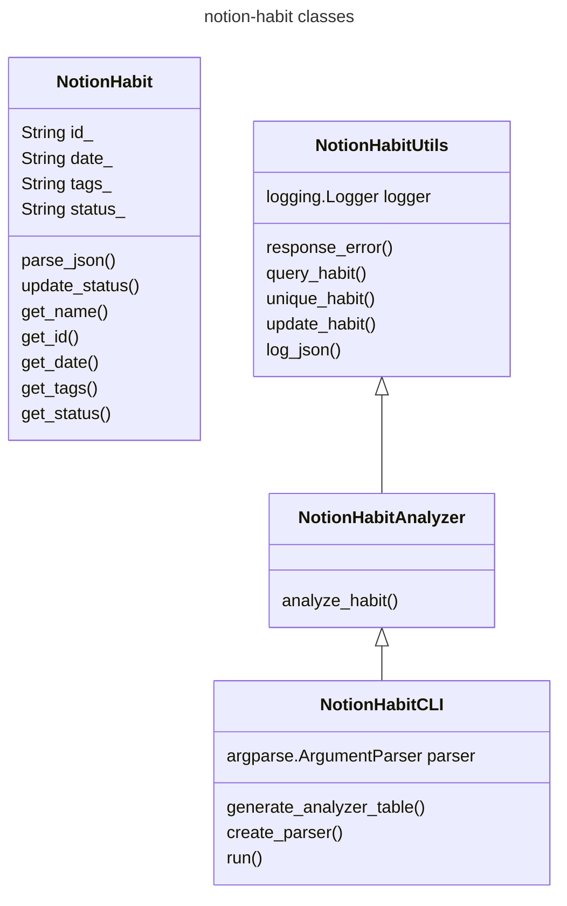

# Habit Tracker

## About The Project

```mermaid
---
title: notion-habit classes
---
classDiagram

    class NotionHabit{
        String id_
        String date_
        String tags_
        String status_
        parse_json()
        update_status()
        get_name() 
        get_id()
        get_date()
        get_tags()
        get_status()
    }

    class NotionHabitUtils{
        logging.Logger logger
        response_error()
        query_habit()
        unique_habit()
        update_habit()
        log_json()
    }
    
    class NotionHabitAnalyzer{
        analyze_habit()
    }

    class NotionHabitCLI{
        argparse.ArgumentParser parser
        generate_analyzer_table()
        create_parser()
        run()
    }

    NotionHabitUtils <|-- NotionHabitAnalyzer
    NotionHabitAnalyzer <|-- NotionHabitCLI
```

## Getting Started

### Prerequistes

### Installation

## Usage 

## Roadmap

